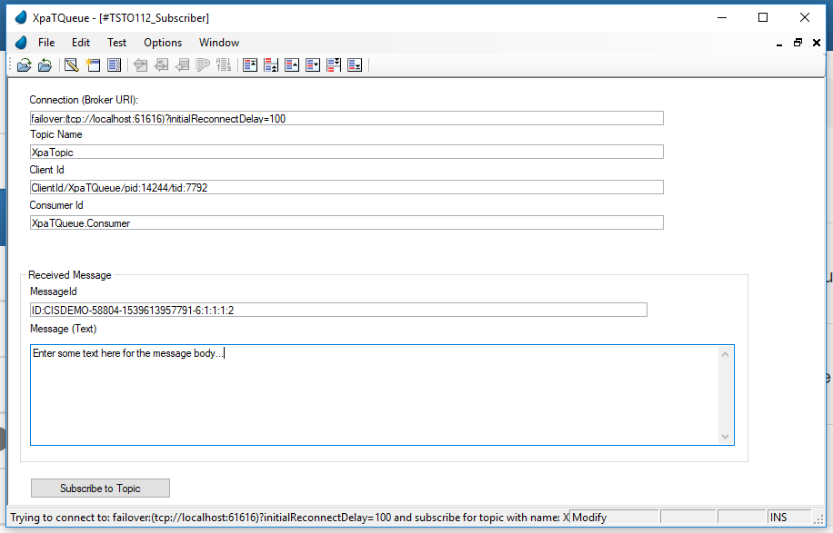

# TSTO112_Subscriber

TSTO112_Subscriber is an online (screen mode) Magic program which demonstrates integration pattern publish/subscribe with XpaTQueue component. TSTO112_Subscriber implements the "Consumer". It connects to a ActiveMQ broker and then subscribes to all messages for a specific topic. When a message is published to that topic,TSTO112_Subscriber will get notified by XpatQueue (.NET library) via an (.NET) event. The (text) message and some details (like the ActiveMQ message id) gets then displayed.  

Here is a sample screen for this program where the user did subscribe for a topic named "XpaTopic" and where it already received one or more messages for that topic.  

  
## Screen elements
### Connection (Broker URI)
A ActiveMQ connection URL as it's documented here: [ActiveMQ URI Protocols](http://activemq.apache.org/uri-protocols.html). The initial value is read from a configuration file (-> [XPAMQB900_ReadConfig]()).  

### Topic Name
ActiveMQ (JMS) Topic name as it is required for Publish/Subscribe where no queue name but this topic name is required. Can be any valid topic name and supports wildcards and virtual topic names. Check the documentation of XpaTQueue and ActiveMQ website for furter information.  

### Client Id
Id string set by the client during connect in order to identify it's connection. The client id in TSTO112_Subscriber is generic and does contain the Windows process id (pid) and the Windows thread id (tid) of the process/thread which implemented the client side. This helps to get unique names and this helps with debugging, since you can start muliple clients (multiple consumers, multiple produceres, ...). ActiveMQ / JMS does not require this id to be unique and in fact you might get duplicate client ids by coincidence when you run XpaTQueue samples on multiple machines.  

### Consumer Id
Another identifier which allows to identify a group of consumers which do share the consumer id.  
(TODO: Requires better explanation, that whole concept needs to be elaborated a bit)  

### Message Id
When the client did successfully connect to a ActiveMQ broker and subscribed to messages for a specic topic, it will receive "OnMessge" events from the ActiveMQ .NET class library when a message from ActiveMQ was received. The property "NMSMessageId" of that message will then get displayed here + some more properties of the received message in additional fields assigned to group control "Received Message".  

### Message (Text)
See also above. Field will get the message text of the received message. Note that XpaTQueue currently does *only* support text messages. There's also Blob messages and binary message types and suppoort for those will be added in a future version.  

## Buttons
### Subscribe tp Topic
Connects to the ActiveMQ broker and subscribes to a Topic

## Known issues

- Exception and Errorhandling in this early version of XpaTQueue is insufficient, Exceptions do not get displayed, ... . If you specified a wrong connect URI or that broker is actually not even running XpaTQueue client may hang like forever. These issues should be fixed in next major version.