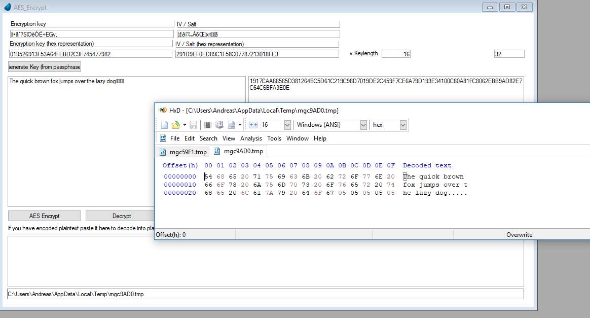

# Padding in XpaTCrypt / mgcrypt.dll

Block cipher modes for symmetric-key encryption algorithms (ECB, CBC, ...) require that the input length (plaintext) is a multiple of the blocksize. Does the message length differ from this requirement it has to be "padded" to get it to that length. Unfortunately there is not really a clear standard for this and different implementations of a block cipher may differ in the way they pad the plaintext.

XpaTCrypt resp. mgcrypt.dll uses Crypto++ 7.0 library where PKCS#7 padding is the default padding scheme for blockciphers. It would support different padding schemes as well, there's currently however no way to configure this in XpaTCrypt (or a parameter / option in mgcrypt.dll). If you need to support a different padding scheme (like the one from Magic Cipher() function which always pads messages with 0 Bytes) you currently need to pad the plaintext before encryption yourself.  

If two implementations of AES ECB/CBC encryption use different padding schemes it is likely that one does not remove the padding bytes of the other implementation. You will note that in example TSTO002_AES_Encrypt when you encrypt plaintext with mgcrypt.dll (program: XpaTCrypt.AES_Encrypt) and decrypt the ciphertext with Magic's Decipher() function (program: XpatCrypt.AES_Encrypt_MagicDecipher). mgcrypt.mgcrypt_AES_Encrypt padded the plaintext conforming to PKCS#7, Magic expects padding with null Bytes. On the screen you will see that the plaintext (after decryption) ends with some special characters, that's the PKCS#7 pad bytes:  
  

> NOTE: When you encrypt a message with Magic Cipher() and choose an encryption mode which requires padding (ECB, CBC) Magic will pad the message with 0 Bytes and many implementations of AES decrypt will not be able to decrpyt that message. mgcrypt.mgcrypt_AES_Decrypt f.i. will return an error telling that the encrption failed and the detailled error description (which is currently not returned to caller) in this case would be:  
  
  

Currently there's no way to decrypt ciphertext created with Magic. In a next version the padding scheme will get a parameter or configuration option and mgcrypt.dll then will be able to decrpyt these messages and remove the padding before returning the plaintext. If that's an option you can also work with an encryption mode differnt to ECB and CBC which does not require padding (f.i. CFB or OFB). There's a note regarding this padding issues in the online documentation of [Xpa's Cipher function] (http://kb.magicsoftware.com/articles/bl_Reference/Cipher-xpa-3x/?q=Cipher&l=en_US).  
